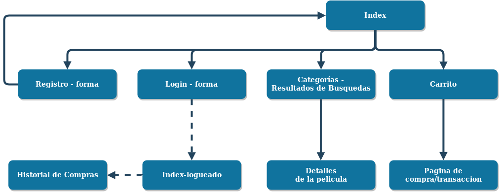
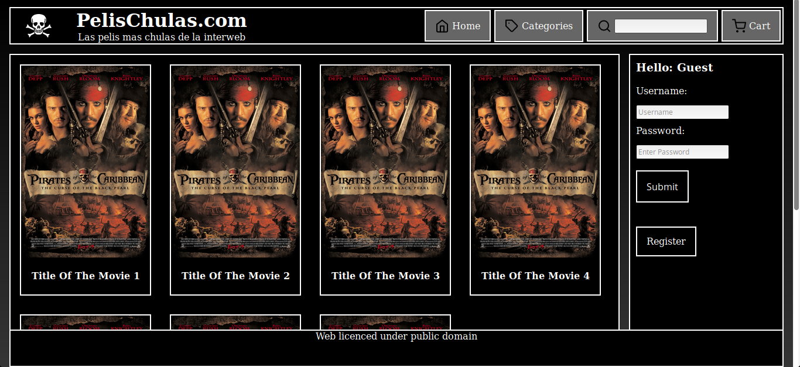
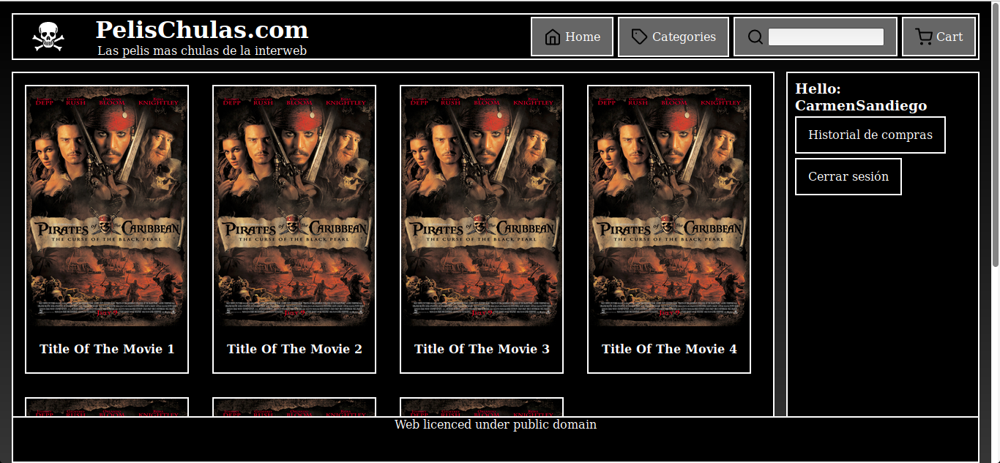
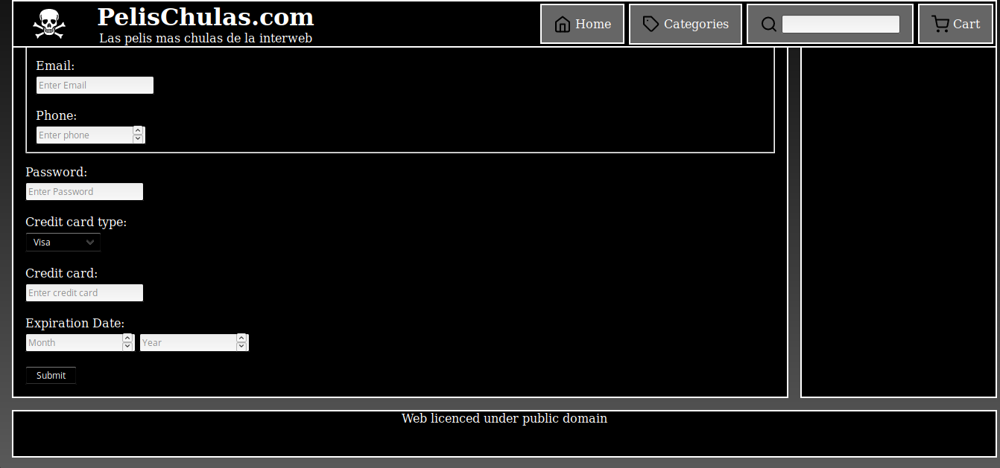
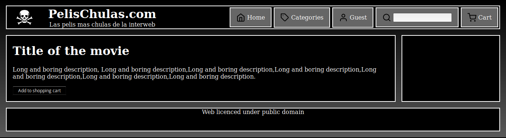

# Documentación semana 1

Autores: Pablo Sánchez Redondo y Antonio Solana Vera

## Mapa de navegación

## Diagramas de la web

* Header: acessible desde todos lados, contiene el logo y formas para volver a la página de inicio, además de una barra de busqueda que te lleva a la de resultados. También proporciona acceso al carrito.

* Sidebar: Zona de usuarios. Login y registro para los invitados y acceso al historial y cerrar sesion para los que se logueen.

* Footer: Información básica de la página web.

* Contenido: Zona donde se muestra el contenido de el frame actual. Ya sean resultados, el carrito o la forma de registro por ejemplo.

## Descripción de los archivos de entrega

1. index.html: Fichero inicial o pagina de inicio. Es la pagina de inicio de los usuarios no logueados.

1. docs:
   
   * Este documento

1. css:
   
    * main.css: Documento de estilos css

1. frames:

   * index_logged.html: Pagina de inicio para usuarios que se han logueado previamente.
   * movie_det.html: Detalles de cada película.
   * register.html: Forma para el registro de un nuevo usuario.

1. images: Imagenes que utilizamos en la página.

## Descripción del funcionamiento e implementación de las páginas web

## Resultados y evidencias del trabajo realizado

Indice:

Indice logueado:

Forma de registro:

Detalle de la película:
