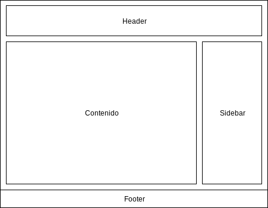

# Documentación semana 1

Autores: Pablo Sánchez Redondo y Antonio Solana Vera

## Mapa de navegación

## Diagramas de la web

* Header: acessible desde todos lados, contiene el logo y formas para volver a la página de inicio, además de una barra de busqueda que te lleva a la de resultados. También proporciona acceso al carrito.

* Sidebar: Zona de usuarios. Login y registro para los invitados y acceso al historial y cerrar sesion para los que se logueen.

* Footer: Información básica de la página web.

* Contenido: Zona donde se muestra el contenido de el frame actual. Ya sean resultados, el carrito o la forma de registro por ejemplo.

## Descripción de los archivos de entrega

1. index.html: Fichero inicial o pagina de inicio. Es la pagina de inicio de los usuarios no logueados.

1. docs:

   * Este documento

1. css:

    * main.css: Documento de estilos css

1. frames:

   * index_logged.html: Pagina de inicio para usuarios que se han logueado previamente.
   * movie_det.html: Detalles de cada película.
   * register.html: Forma para el registro de un nuevo usuario.

1. images: Imagenes que utilizamos en la página.

## Descripción del funcionamiento e implementación de las páginas web

La página se divide en 3 partes: un header arriba, un footer abajo y un div con clase main que se encuentra en medio.

1. Header:

    La posición está en modo sticky. De esta manera hemos conseguido que nos siga solo cuando es necesario. A diferencia de fixed que siempre se encuentra en el mismo lugar, sticky se "engancha" a nuestro scroll.

    Con respecto a los elementos contenidos en el header, está formado por dos div en modo flex.

    El primero (header-link-div) es el contiene el título de la web, la descripción y el logo. Es enteramente clickable y nos devuelve a la raíz de la web.

    El segundo, denominado navbar contiene los botones de navegación de la web y la barra de búsqueda. Todos estos elementos están generalizados en una clase nav-element excepto el menú de categorías para el cual nos hizo falta otra clase: dropdown-menu. Dentro del dropdown-menu tenemos un nav-element que es el que vemos siempre y un div con clase dropdown que solo se muestra cuando hacemos hover sobre el botón de categorías.

    Para hacer funcionar los dropdowns hemos tenido que usar una propiedad en css que permite modificar varios elementos a la vez. De esta forma hemos creado una propiedad que muestra el div que queremos cuando alguien hace hover sobre otro div distinto. Así, el hover de un div cambia la visibilidad de otro, mostrándolo de forma dinamica.

 2. Main:

    Esta formado por dos contentores: content y sidebar.

    Content es el que está en el centro de la página.

    En la página de inicio contiene unos divs muy simples que mantienen la foto de la película y el título uno encima del otro con flex en modo row.

    En la página de registro content tiene dentro un form con todos los campos que hemos podido para comprobar cómo funcionaban. Cada uno de estos tiene una label asociada al id del input. También hemos usado un fieldset con su propia leyenda para la parte de confirmación de la cuenta, dando la opción de correo o teléfono móvil.

    Sidebar es el div lateral que contiene la información del usuario que está logueado actualmente y los botones para hacer log-in o registrarse. Está formado por un h3 con el saludo al usuario o guest, un form muy simple que nos pide un usuario y una contraseña y el botón submit para loguearse y un link para ir a la página de registro.

    En el resto de páginas, el sidebar se encuentra vacío, pero no lo quitamos por que queremos mantener la estructura todo lo que se pueda.

3. Footer:

    El footer al igual que el header esta en modo sticky para que solo se enganche a la pantalla cuando hacemos scroll lo suficiente. Por lo demás no tiene nada interesante, es solo un div con fondo negro y un texto indicando la licencia de la web.

En general hemos decidido usar flex para casi todos los elementos de la web. Esta nos ha parecido la solución más fácil y limpia. Utilizando flex-direction para cambiar de horizontal a vertical la ordenación de los divs hijo nos las hemos arreglado para que todo quede colocado en su lugar. También haciendo uso de flex-wrap hemos conseguido que las películas se adapten a la pantalla.

## Resultados y evidencias del trabajo realizado

Indice:

Indice logueado:

Forma de registro:

Detalle de la película:
